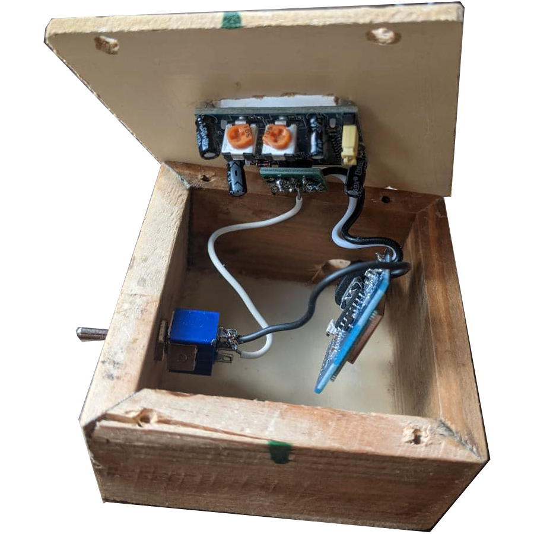

# Sensor Pir Pápa Noel - BETA

¿Necesitas que alexa te avise cuando Papa Noel ha llegado? Monta un sensor de movimiento con arduino que envia notificaciones por Alexa. Tambien vale para los reyes magos, y bueno, para los intrusos...

 

# ¿Que es un sensor Pir?

 

Los sensores infrarrojos pasivos (PIR) son dispositivos para la detección de movimiento. Son baratos, pequeños, de baja potencia, y fáciles de usar. Por esta razón son frecuentemente usados en juguetes, aplicaciones domóticas o sistemas de seguridad. Si te interesa saber mas, te dejo en la documentación un enlace donde lo explican en profundidad.

# Hardware

### Necesario para darle vida

|   |   |   |   |
|---|---|---|---|
| Wemos D1 Mini ||[](https://www.amazon.es/AZDelivery-D1-Mini-desarrollo-compatible/dp/B0754N794H)| Será el encargado de controlar el pulso del timbre y notificar a Alexa. |
| Sensor Pir ||[](https://es.aliexpress.com/item/32849387755.html?spm=a2g0s.9042311.0.0.542363c0Y6L3aV)| Sensor de movimiento por infrarojos. |
| Interruptor ||[](https://es.aliexpress.com/item/32859210037.html?spm=a2g0s.9042311.0.0.542363c0Y6L3aV)| Interruptor para desactivar el sensor de forma manual. |

# Herramientas

### Necesarias para realizar la operación

|   |   |   |
|---|---|---|
| PC + Arduino IDE  | | Necesitaremos el IDE de Aduino:  <a href="https://www.arduino.cc/en/main/software">descarga</a> y un Pc al que conectarlo. |
| estaño para soldar | | Lo usaremos para soldar los componentes.  |
| soldador de estaño |  | Vale cualquier soldador, aunque recomiendo la marca JBC.  |
| cable mini-usb  ||Necesario para poder flashear el código al Wemos D1 Mini.|


# Preparación

Pasos previos antes de construir el dispositivo

|   |   |   |
|---|---|---|
|  0 |   | Recomiendo ver el video tutorial de un ejemplo parecido: https://www.youtube.com/watch?v=cgfVXPfCgkc  |
|  1 |   | Nos registramos en <a href="https://www.smartnest.cz/index/ES">Smartnest</a> y creamos un dispositivo Timbre  |
|  2 |   | Desde la configuracion de Alexa (App movil o web) vinculamos nuestra cuenta Smartnest y elegimos el dispositivo que notificará |
|  3 |   | Con las credenciales generadas de Smartnest, y nuestra configuración de Wifi, modificamos en el codigo la siguiente sección:|

``` #define SSID_NAME "Wifi-name"               // Your Wifi Network name
#define SSID_PASSWORD "Wifi-password"           // Your Wifi network password
#define MQTT_BROKER "smartnest.cz"              // Broker host
#define MQTT_PORT 1883                          // Broker port
#define MQTT_USERNAME "username"                // Username from Smartnest
#define MQTT_PASSWORD "password"                // Password from Smartnest (or API key)
#define MQTT_CLIENT "device-Id"                 // Device Id from smartnest 
``` 

# Proceso

El proceso que yo segui es el siguiente. En resumen, nos vale cualquier tipo de "arduino" con adaptador wifi y un sensor Pir, en mi caso, utilice un "wemos d1", el esquema que dejo a continuación es practicamente igual para todos.


|   |   |   |
|---|---|---|
|  1 |   | Instalar la libreria PubSubClient en el IDE - <a href="https://github.com/knolleary/pubsubclient">ver codigo</a> .  |
|  2 |   | Flashear el codigo en el arduino nano - <a href="https://github.com/danijerez/sensorpir_alexa/blob/master/pir/pir.ino">ver codigo</a> .  |

 

 

# Resultado
Podemos proteger o camuflar el circuito en una caja y posteriormente conectarlo a la corriente.

 


# Pruebas

Dejo algunos videos de prueba mientras hice el proyecto, Alexa permite personalizar bastante el sonido de las alertas. Espero que os guste!

|   |   | 
|---|---|
|[](https://youtu.be/XkGclKIlED0 "sensor pir alexa")| Probando el funcionamiento del sensor pir|

# Documentación

* https://www.youtube.com/watch?v=cgfVXPfCgkc
* https://www.smartnest.cz
* https://github.com/knolleary/pubsubclient
* https://www.luisllamas.es/detector-de-movimiento-con-arduino-y-sensor-pir
